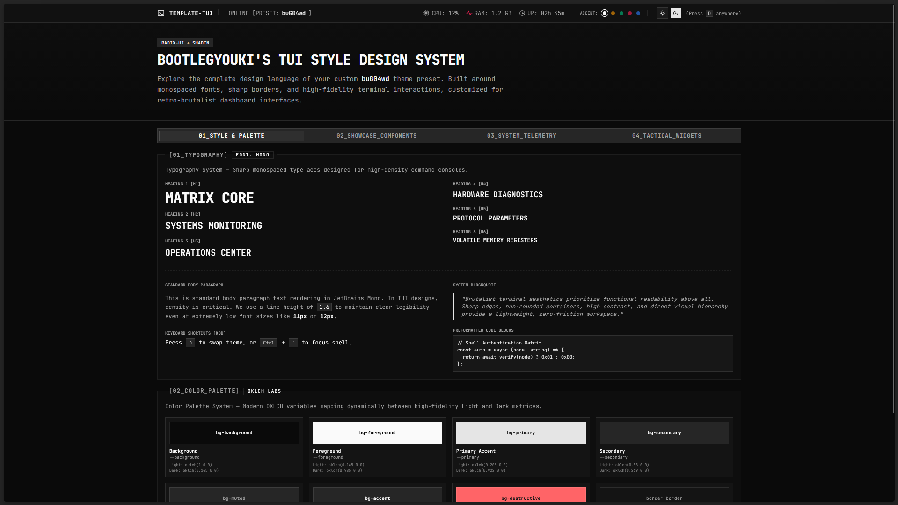
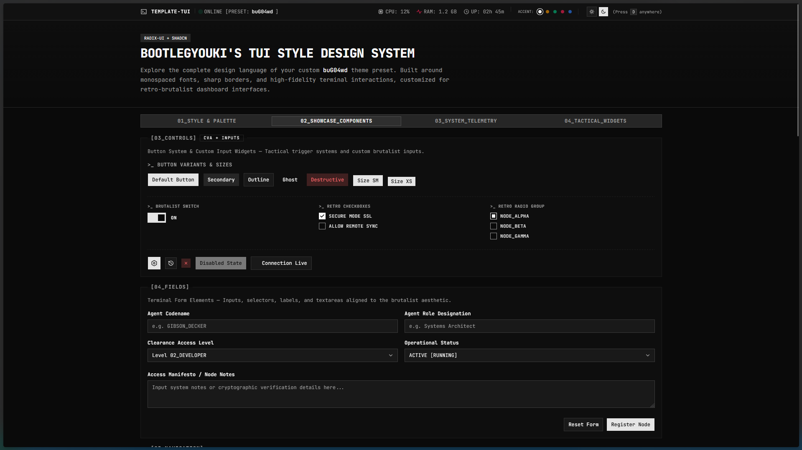
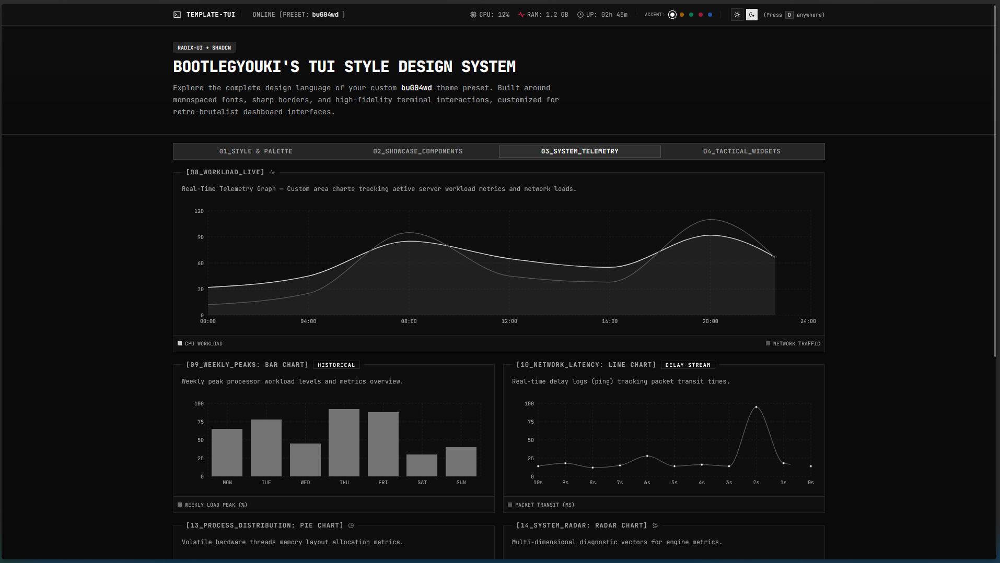
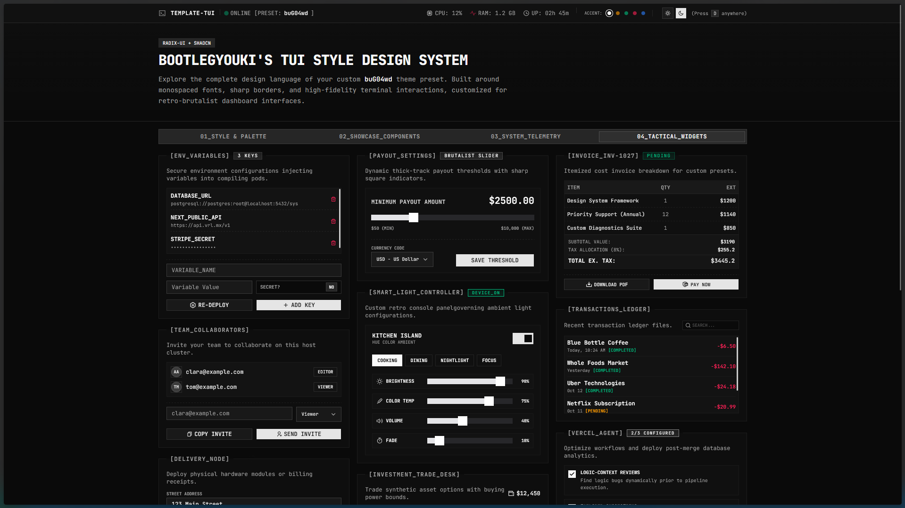

# 📟 template-tui — Retro-Brutalist TUI Design System

`template-tui` is a high-fidelity, production-ready template designed for building **Terminal User Interface (TUI) style design systems**, tactical control dashboards, and retro-brutalist web applications. 

Powered by **React 19**, **Vite 8**, **Tailwind CSS v4**, **Radix UI**, and **Shadcn**, this template offers a robust foundation for developers looking to build sleek, monospaced interfaces with sharp geometric borders, rich dark/light modes, and high-fidelity terminal interactions.

---

## 📸 Visual Showcase

<div align="center">
  <table border="0">
    <tr>
      <td width="50%" align="center">
        
        <br/><em>Theme Styles & Color Accents</em>
      </td>
      <td width="50%" align="center">
        
        <br/><em>Design System Showcase Overview</em>
      </td>
    </tr>
    <tr>
      <td width="50%" align="center">
        
        <br/><em>System Telemetry & Charts</em>
      </td>
      <td width="50%" align="center">
        
        <br/><em>Tactical Widgets & Inputs</em>
      </td>
    </tr>
  </table>
</div>

---

## 🚀 Key Features

*   📟 **Brutalist Grid Layouts**: Integrated `<TuiContainer>` panels rendering geometric fieldset borders, legend headers, and tactical layout alignments.
*   🎨 **Interactive Accent Color Themes**: Multi-theme selector built into the sticky status bar (supporting Monochrome Gray, Tactical Amber, Terminal Green, Cyber Rose, and Cobalt Blue) that automatically synchronizes CSS variables across dark/light mode toggles.
*   ⚡ **Tactical Input Widgets**: Custom brutalist switches, retro checklist boxes, and radio node selectors mapped directly to operational hooks.
*   🔍 **RemixIcon Library Explorer**: Categorized and searchable grid containing 40+ standard web/app icons, featuring dynamic sizing selectors, theme color overrides, and direct click-to-copy import utility linked to the logging console.
*   📜 **Console Log Stream Viewer**: Slide-out drawer sheet logging real-time user actions, telemetry alerts, and clipboard copies, simulating a non-volatile local system terminal.
*   📊 **Telemetry & Charts**: Interactive telemetry boards rendering dynamic CPU, RAM, and network throughput charts built using **Recharts**.
*   🧠 **Graphify Knowledge Graph**: Fully integrated code AST map (`graphify-out/`) providing automated subagent steering rules, workflows, and token-saving semantic queries for AI coding assistants.

---

## 🛠️ Quick Start

Install dependencies and start development using `pnpm` (workspace preference):

```bash
# 1. Install workspace dependencies
pnpm install

# 2. Launch the local development server
pnpm run dev

# 3. Compile the production-ready minified bundle
pnpm run build
```

---

## 🧹 Template Management (Cleanup & Restore)

The design system showcase is fully isolated from the core application canvas. We provide automated, cross-platform scripts to easily clear the showcase or restore it back at any time:

### 🧼 Clean the Template (Start Fresh)
To delete the entire showcase folder, clean the imports, and set up a clean, minimal retro-brutalist starter page in `src/App.tsx`:
```bash
pnpm run rm-template
```

### 📟 Restore/Initialize the Template
If you want to restore the design system showcase files and the original `src/App.tsx` back (without affecting your other custom work or modified files in the repository):
```bash
pnpm run int-template
```
*(Note: This utilizes local Git history to cleanly restore `src/components/tui-template` and the original `src/App.tsx` from `HEAD`, leaving any other files you have created or modified completely untouched.)*

---

## 🧠 maintaining the Graphify Knowledge Graph

If you use AI coding assistants (like Cursor, Claude Code, or Antigravity), this template includes built-in Graphify rules and workflows. 

To keep the knowledge graph synchronized with your directory layout and code structure after you start writing custom modules, run this offline command (zero LLM token cost):

```bash
graphify update .
```

*Note: Graphify ignore rules are pre-configured in `.graphifyignore` to keep your graph focused on code logic, excluding lockfiles, build directories, and visual templates.*
